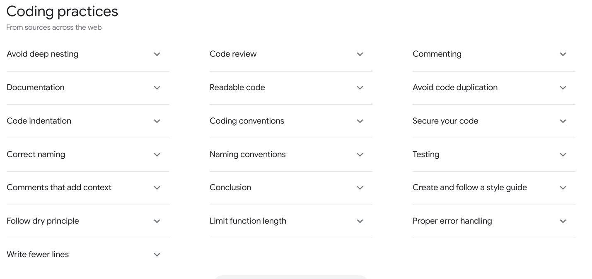

## Welcome to the UBC iGEM Wiki Interview

## Pre Interview Instructions
1. Install [Git](https://git-scm.com/).
2. Install [Zola](https://www.getzola.org/documentation/getting-started/installation/).
3. Install a text editor.

Hint: you will be expected to use Git!

## What will I be expected to do at the interview?
You will be completing an issue and making a PR that will be given to you during the interview. This interview problem was designed as a way to gauge how well you can take on a real wiki task. Be expected to talk about your design choices throughout every step of the interview.

## How can I prepare? 
If you have taken a computer science course or done web development then you are good to go. The interviewer will ask about how and why you chose certain design choices, here are a few things you can mention.

